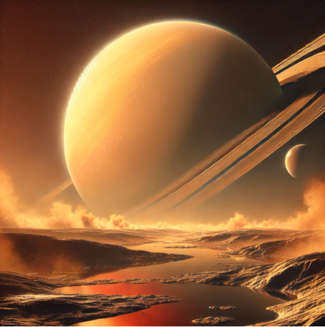

# Solid Earth and Planetary Sciences 

Welcome to my GitHub profile! Here you'll find a collection of directories that represent work I've collaborated on, as well as personal projects. 

  
   
  <em>A view from Titan, artificial intelligence (AI) generated image.</em>

